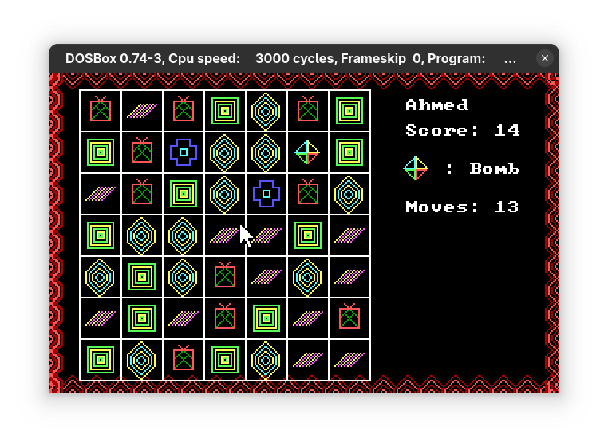

# Candy Crush Assembly



## Description

Candy Crush Assembly is a complete match-3 puzzle game written in x86 Assembly. The game includes:
- 3 increasingly difficult levels
- Multiple candy types with unique visuals
- Special bomb candies with explosion effects
- Score tracking and high score system

## Demo Video
Check out the gameplay video on YouTube:
[Candy Crush Assembly Demo](https://youtu.be/lxzfWXKaycY)

## Installation and Setup

### Prerequisites

- [DOSBox](https://www.dosbox.com/download.php?main=1) - an x86 emulator with DOS
- MASM 6.11 (Microsoft Macro Assembler)

### Setup Instructions

1. **Install DOSBox**:
   - Download DOSBox from the official website
   - Install it following the instructions for your operating system

2. **Set up MASM 6.11**:
   - Extract the MASM611 archive to a directory on your computer
   - Copy candy.asm and m1.lib files to your MASM directory

3. **Run DOSBox**:
   - Launch DOSBox
   - Mount your MASM directory, for example:
     ```sh
     mount c ~/path/to/masm611 # C:\path\to\masm611 for windows
     c:
     ```

4. **Compile the game**:
   ```sh
   ml candy.asm
   ```

5. **Run the game**:
   ```
   candy.exe
   ```

## How to Play

### Controls
- Use the **mouse** to select and swap candies
- Press **Space** to continue between screens
- Press **Esc** to exit the game

### Gameplay
1. Swap adjacent candies to create a row or column of at least 3 matching candies
2. When candies match, they break and increase your score
3. New candies will fall from the top to fill empty spaces
4. Special bomb candies can be used to clear all candies of a specific type
5. Complete each level's score objective before running out of moves

### Game Objectives
- Level 1: Score 50 points with 15 moves
- Level 2: Score 30 points with 15 moves (with obstacles)
- Level 3: Score 30 points with 5 moves (with more obstacles)

## Credits

Created by:
- Hanan Noor Jahangiri (20i-0719)
- Ahmed Iqbal (20i-0447)